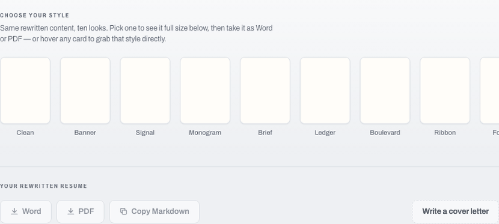
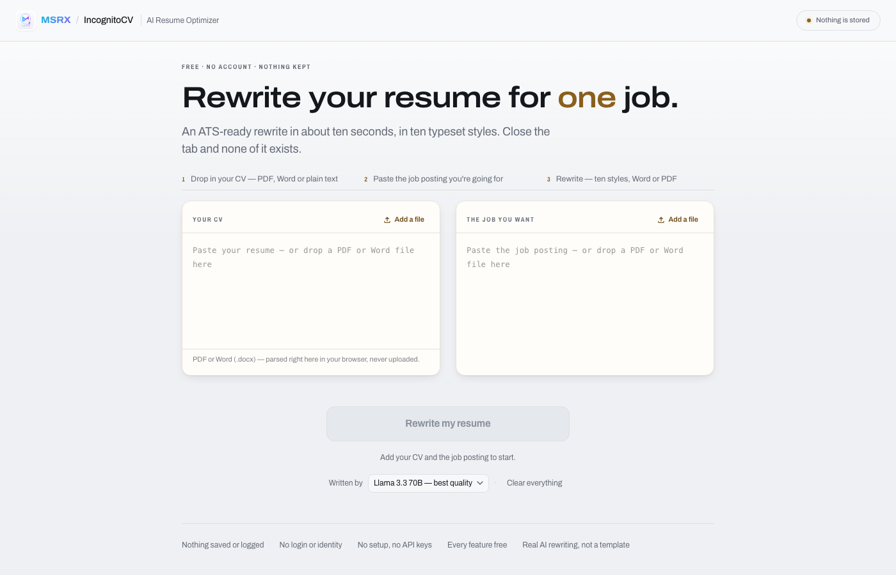

# MSRX IncognitoCV

**[cv.msrx.co.in](https://cv.msrx.co.in)** — score your CV against a job posting without uploading it anywhere. Free, no account.



*The score recomputes on every keystroke, in the page. Nothing is sent anywhere to produce it.*



## The wedge

Jobscan, Teal and Rezi all do the same thing: you upload your resume to their servers, they return a match score, and you pay for the privilege. Your CV is the most identity-dense document you own — full name, address, phone, employment history — and handing it to a third party to get a percentage back is a poor trade.

`match.js` is the same class of analysis with **zero network calls**. The scoring is arithmetic over text, not inference, so it runs locally and instantly, and the CV never leaves the machine.

## Deliberately not AI

A score that changes when you re-run it is not a score.

The match engine is a pure function of its inputs — same text in, same number out, every time. That is what makes it testable, and what makes "your score went 41 → 88" a claim rather than a vibe. AI is available separately for rewriting and cover letters, where non-determinism is the point; it is never in the scoring path.

## What's here

```
core.js           CV parsing and model            923 lines
match.js          the deterministic match engine  523 lines
app.js            UI                              517 lines
api/optimize.js   AI rewrite + cover letters,     303 lines
                  SSE streaming with retry and model fallback
```

**Zero dependencies.** No framework, no build step, no `node_modules`. It is HTML, CSS and JavaScript that a browser runs directly — which is also why the privacy claim is verifiable: open the network tab and watch nothing leave.

51 tests, run with `npm test` (plain `node`, no test framework).

## Gotcha worth recording

The Content-Security-Policy here omits `'unsafe-inline'`, which silently nulls every `onclick=` attribute — no error, the handler simply never fires. All events are wired through `addEventListener`. If you fork this and a button goes dead, that's why.

## Running it

```bash
npm run serve
```

Any static file server works. There is nothing to build.

## Licence

No licence is granted. The source is public to read, not to redistribute.
